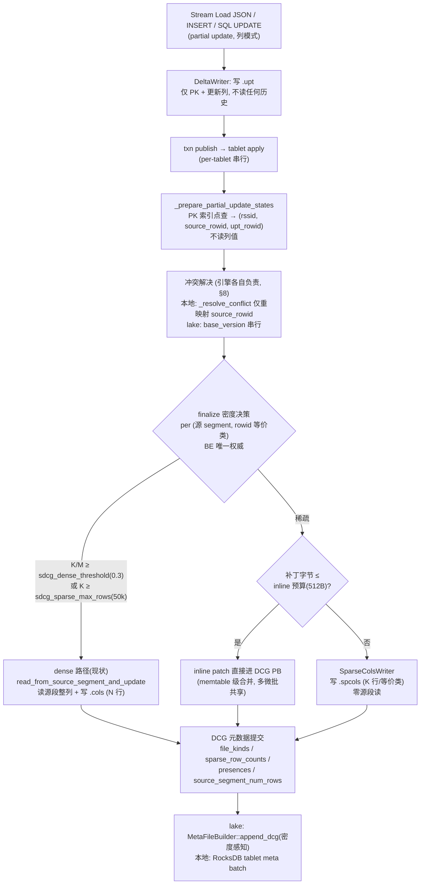
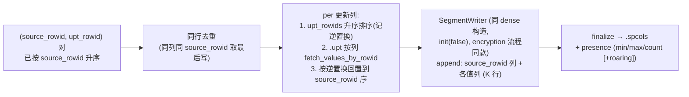
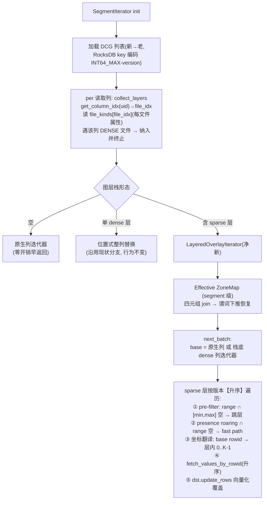
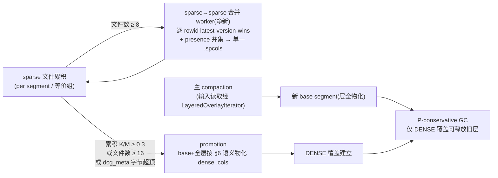

# Sparse Delta Column Group (SDCG) —— 稀疏列上的 Partial Update 设计

- Status: design v1.3
- Owner: TBD
- Last Updated: 2026-06-04
- 修订历史、验证记录、Spike 报告与 H4/H5 改造方案原文:见配套文档 [2026-06-04-sdcg-spikes-and-fix-plans.md](./2026-06-04-sdcg-spikes-and-fix-plans.md)

---

## 0. 摘要

本文是 **StarRocks 主键表 partial update 的下一代设计**,目标场景是 **CDC + 高频小批量更新 + 单批内异构列**。

核心方案 **SDCG (Sparse Delta Column Group)**:在既有 dense DCG(`.cols`,整列重写)之外引入**稀疏增量文件 `.spcols`** ——

- **每个 rowid 等价类一个 `.spcols` 文件**(文件内各列共享同一 rowid 集合,行数统一为 K),标准 Segment v2 格式,`SegmentWriter` 零改动;
- 写入只读不可变的 `.upt`,**完全不读源 segment**(消除现有列模式的 M× 写放大);
- 读取由新组件 `LayeredOverlayIterator` 把 sparse 层**按版本升序**叠加到 base(或最新 dense)之上,last-write-wins;
- **Effective ZoneMap** 重开有 DCG 表的 segment 级谓词下推(四元组格 join,可证明不漏行);
- 后台收敛(sparse 合并 / promotion / compaction)+ **P-conservative GC**(只有 DENSE 覆盖可释放旧层)保证不丢数据、文件数有界;
- dense/sparse 由 **BE 在 finalize 时唯一决策**(密度 + K 绝对值双因子);
- Variant path 级更新仅预留 schema 位,独立设计轨。

与业界对比:获得 Doris skip-bitmap 的**行×列双稀疏表达力**,但不付 base 永久存储税、不需写时读历史;比 ClickHouse Patch Parts 多出**单批内 per-row 异构列**与谓词下推保真。

---

## 1. 背景与动机

### 1.1 现状的三个痛点(源码已核实)

1. **`AUTO_MODE` 形同虚设。** FE 对 INSERT/SQL 默认下发 AUTO_MODE(`InsertPlanner.java:456`),但 BE 列模式选择分支只匹配 `COLUMN_UPSERT_MODE/COLUMN_UPDATE_MODE`(`delta_writer.cpp:307-318`),AUTO_MODE 永不命中,端到端退化为 ROW_MODE(读整行 + 写整行)。
2. **列模式(DCG)小批量写放大严重。** `read_from_source_segment_and_update`(`rowset_column_update_state.cpp:319`)全量扫源 segment 整列——更新 100 行也要把 100 万行读出再写回。
3. **DCG 存在即关闭非 key 列的 segment 级 zone map 跳过。** `segment.cpp:307` `return st.ok() && dcgs.size() == 0;`(key 列豁免于 `:322`;page 级 ZM/BF 对 dense DCG 仍工作)。高选择性查询失去 segment 级剪枝。

### 1.2 目标场景

- **CDC 同步**:上游消息只带 PK + 变更列(2–10 列),目标表上百列
- **多源宽表**:多条 CDC 流融合,**单批次内不同行更新不同列**
- **运维诉求**:写吞吐 ≥ 10k QPS、查询 P99 不抖、上游 DB 配置零侵入

### 1.3 现有方案为何不够

| 方案 | 致命问题 |
|---|---|
| StarRocks ROW_MODE | 读整行 + 写整行,小批量 N× 写放大 |
| StarRocks COLUMN_MODE | 读源 segment 整列,M× 写放大;关闭非 key 列 segment 级 zone map |
| Doris Flexible (skip_bitmap) | base 每行恒带 bitmap(永久存储税);写时需读历史(高 IOPS、需 row store) |
| ClickHouse Patch Parts | 单批不支持异构列;source part merge 后退化 hash join |
| Snowflake/Databricks/Iceberg | COW 整文件重写,非轻量更新 |

---

## 2. 业界方案一览

| 系统 | 异构列表达 | 物化时机 | 关键机制 / 限制 |
|---|---|---|---|
| **ClickHouse** Patch Parts | ❌ 单语句 SET 列固定 | background merge | 独立 patch part;Merge 模式按 `_part_offset` 零开销,Join 模式慢 39–121% 且须装内存 |
| **Doris** Flexible (3.1+) | ✅ per-row skip bitmap | **写时**(MoW) | base 每行带 `__DORIS_SKIP_BITMAP_COL__`;写时 PK 点查回填历史写整行;并发冲突走 publish 期 transient rewrite |
| **Paimon** | null 哨兵 + sequence-group | compaction | 丢真 null 语义 |
| **Hudi** | null 哨兵 payload | MoR compaction | payload 插件式 |
| **Pinot** | per-column merge strategy | 实时 in-memory | 列级合并函数,内存型 |
| **Kudu** | UPSERT 缺列保留历史 | per-column DeltaFile | 列级差分 |

四种"异构列"表达模式:**A** 显式 bitmap(Doris,强表达/base 永久开销)、**B** null 哨兵(Paimon/Hudi,丢 null 语义)、**C** 列级合并策略(Pinot,内存型)、**D** 独立 patch 文件(CK,写轻/单语句固定)。

**SDCG = D + patch 内 per-group rowid 集合**:把 patch 方案的稀疏度从"行稀疏"扩展到"**行×列双稀疏**",获得 A 的表达力但不付永久 base 开销。

---

## 3. 总体架构

```
                              ┌────────────────────────────────────────────┐
 导入                          │                 物理存储                     │
 Stream Load / INSERT /        │  base segment ── seg.dat      (N 行)        │
 SQL UPDATE                    │  dense  DCG  ── *.cols        (N 行, 整列)  │
   │                           │  sparse DCG  ── *.spcols      (K 行/等价类) │
   ▼                           │  更新载荷    ── *.upt          (不可变)      │
 DeltaWriter ─→ .upt           └────────────────────────────────────────────┘
   │ publish                                   ▲          ▲
   ▼                                           │写        │读
 apply/finalize                                │          │
   │ PK 点查 → (rssid, source_rowid, upt_rowid)│          │
   ▼                                           │          │
 密度决策 (BE 唯一权威) ───────────────────────┘          │
   ├─ dense:  现状路径 (.cols)                            │
   ├─ sparse: SparseColsWriter (.spcols, 零源段读)         │
   └─ inline: 字节预算内补丁直接进 DCG PB                  │
                                                          │
 查询                                                      │
 SegmentIterator ─→ 反向索引 col_uid→图层栈 ─→ LayeredOverlayIterator
                     │                          (sparse 层版本升序叠加)
                     └─ Effective ZoneMap (segment 级谓词下推恢复)

 后台: sparse 合并 worker ─→ promotion(物化 dense) ─→ P-conservative GC
 共享: be/src/storage/partial_update/ helper 模块 (本地 + lake 两引擎复用)
```

---

## 4. 数据结构

### 4.1 物理文件布局

```
base segment: seg_A_0.dat (N = 1,000,000 行)          .upt (本批更新载荷, 不可变, 顺序写)
┌──────┬──────┬──────┬──────┬─────┐                  ┌─────────────┬───────┬───────┐
│ pk   │ c1   │ c2   │ c3   │ ... │                  │ (upt_rowid) │  c2'  │  c3'  │
│  …   │  …   │  …   │  …   │     │                  │   0..K-1    │   …   │   …   │
└──────┴──────┴──────┴──────┴─────┘                  └─────────────┴───────┴───────┘
        ▲ 物理 rowid 0..N-1                                  值的唯一来源(写 DCG 时按列位置读)

dense DCG 文件: A_0_v5_0.cols                 sparse DCG 文件: A_0_v7_0.spcols(一个 rowid 等价类)
(整列重写, 与 base 行号 1:1)                   (K=3 行, 标准 Segment v2, footer.num_rows=K)
┌────────────┐                                ┌──────────────┬────────┬────────┐
│ c2 (N 行)  │ ordinal == base rowid          │ source_rowid │   c2   │   c3   │
│ row 0      │ ← 未更新行带原值               │ (保留 uid)   │        │        │
│ row 1      │ ← 更新行带新值                 ├──────────────┼────────┼────────┤
│ …          │                                │     100      │ v₁₀₀   │ w₁₀₀   │
│ row N-1    │                                │     305      │ v₃₀₅   │ w₃₀₅   │
└────────────┘                                │    9527      │ v₉₅₂₇  │ w₉₅₂₇  │
                                              └──────────────┴────────┴────────┘
                                              ▲ 升序、开 zone map; 文件内值在 ordinal 0..K-1,
                                                读取时必须经 source_rowid 列做 base rowid ↔ 局部
                                                下标翻译(与 dense 的"rowid 即 ordinal"本质不同)
```

要点:
- **一个 rowid 等价类(同批内 rowid 集合完全相同的更新列集合)= 一个 `.spcols` 文件**。文件内各列行数统一为 K,Segment v2 的 footer 单行数约束(`segment.proto:212`、`segment_writer.cpp:321-323`)与 ordinal 体系天然满足,**writer/reader 零格式改动**。
- 经典 CDC(每批同列集合同行集合)= 1 个等价类 = 1 个文件,与现状 dense 单文件数相同;批内异构时文件数 = 等价类数 G,全部挂同一 DCG 版本(`column_files` 本就是 repeated)。
- `source_rowid` 用**保留 uid**(避开真实列与 `FULL_ROW_COLUMN`/op 列等哨兵 uid),**不进入** `column_uids()` 的 uid→file 映射;`SegmentWriter::_verify_footer` 的 uid 唯一性 CHECK 兜底。
- 无 mask、无占位值:每个文件只存它真实覆盖的 K 行。

### 4.2 图层模型(列的多版本视图)

```
列 c2 的图层栈解析(DCG 按版本新→老遍历, 每个 DCG 经 get_column_idx(uid)→file_idx
取该列所在文件, 读 file_kinds[file_idx]; 遇该列的 DENSE 文件即纳入并终止):

 版本   文件                  kind      覆盖行              解析结果
 ────   ──────────────────   ──────    ────────────────    ─────────────────────
 v9     A_0_v9_0.spcols      SPARSE    {77, 12000}          层 ③ (最后 apply)
 v8     A_0_v8_0.spcols      SPARSE    {305, 77}            层 ② 
 v5     A_0_v5_0.cols        DENSE     全部 N 行             层 ① = base(终止遍历)
 v3     A_0_v3_0.spcols      SPARSE    {9527}               ✂ 被 v5 dense 剪枝
 base   seg_A_0.dat                    全部 N 行             ✂ 被 v5 dense 取代

 读取 c2:
   base ← v5.cols 的列迭代器(dense 行完整, 位置式直读, 不进叠加循环)
   然后 sparse 层按版本【升序】apply:  ② v8{305,77} → ③ v9{77,12000}
                                                  └── 行 77 取 v9 值 (last-write-wins)
```

**权威顺序规则**(`Column::update_rows` 是无脑覆盖,顺序即正确性):

1. 按列解析图层栈:DCG 新→老,`file_kinds[file_idx]` 是**每文件**属性;**只有该列的 DENSE 文件可终止遍历**(sparse 只覆盖 K 行,对未覆盖行必须回落更老层/base);
2. base = 栈底 dense 文件(若有)或原生段列;
3. **sparse 层按版本升序(老先 apply、新后 apply)**,最新版本最后落、按行获胜——与现有引擎"含该列的最新 DCG 获胜"语义一致;
4. 承重不变式(DCHECK):DENSE 文件对其源段**行完整**(行数 == 源段 num_rows);同版本层不重叠同行(写侧去重保证);`max(source_rowid) < source_segment_num_rows`(元数据指纹)。

### 4.3 元数据

#### Presence(覆盖信息,双层放置)

每个 `.spcols` 一个 Roaring bitmap(≡ source_rowid 列集合,可互校验/重建;底层 `be/src/types/bitmap_value.h`,需新增 range-cardinality 包装,参照 `DeletionBitmap::get_range_cardinality`):

- **PB 内恒存轻量 pre-filter**:`(min_source_rowid, max_source_rowid, row_count)` —— 扫描 range 与 `[min,max]` 不相交即零成本跳层;
- **完整 Roaring**:序列化 ≤ `sdcg_presence_bitmap_inline_max_bytes`(默认 4096)则内联进 PB(读路径零 IO);超限则存于 `.spcols`,经 read-time merge cache 一次加载跨查询摊销。Lake 的 `dcg_meta` 内嵌于每版本重传的 `TabletMetadataPB`,该上限 + meta 字节硬顶(§7.2)防膨胀。

#### 本地引擎:`DeltaColumnGroupPB`(`olap_common.proto`,现用 tag 1-4,新增自 5)

```protobuf
enum DeltaColumnFileKind { DENSE_COLS = 0; SPARSE_PERCOL = 1; }   // 0=默认 ⇒ 旧 meta 全 dense

message DeltaColumnGroupPB {
    repeated DeltaColumnGroupColumnIdsPB column_ids = 1;   //┐
    repeated string column_files = 2;                      //│ 既有平行数组
    repeated bytes  encryption_metas = 3;                  //│
    optional int64  file_size = 4;                         //┘
    // === SDCG ===
    repeated DeltaColumnFileKind file_kinds = 5;     // 平行; 空 ⇒ 全 DENSE(零回归铰链)
    repeated int64  sparse_row_counts = 6;           // 平行; DENSE 槽写 0
    repeated SparsePresencePB presences = 7;         // 平行; pre-filter + 可选内联 roaring
    optional InlineSparsePatchPB inline_patch = 8;   // 字节预算内的微批内联
    optional int64  source_segment_num_rows = 9;     // 源段物理布局指纹
}

message SparsePresencePB {
    optional uint32 min_source_rowid = 1;
    optional uint32 max_source_rowid = 2;
    optional int64  row_count = 3;
    optional bytes  roaring = 4;       // 仅当 ≤ sdcg_presence_bitmap_inline_max_bytes
}
```

#### Lake 引擎:`DeltaColumnGroupVerPB`(`lake_types.proto:95`;**tag 5 已被 `shared_files` 占用,新增自 6**)

Lake 每个 segment 只有**一条**消息,repeated 字段是**按 entry 堆叠的平行数组**(entry 顺序新→老):

```
DeltaColumnGroupVerPB (segment s 的全部 DCG entry, 平行数组按下标对齐):
  idx:                 0              1              2
  unique_column_ids  [{c2,c3}]      [{c2}]         [{c5}]
  column_files       [v9.spcols]    [v5.cols]      [v2.cols]
  versions           [9]            [5]            [2]
  encryption_metas   [..]           [..]           [..]
  shared_files       [false]        [false]        [false]
  ── SDCG (tag 6+) ──
  file_kinds         [SPARSE]       [DENSE]        [DENSE]      // 6
  sparse_row_counts  [2]            [0]            [0]          // 7
  presences          [{77..12000}]  [{}]           [{}]         // 8
  source_segment_num_rows = N                                   // 9 (标量)
```

`ExtendedColumnRefPB { column_uid, variant_path }` 嵌入两引擎共享的 `DeltaColumnGroupColumnIdsPB`(Variant path 预留位,§9)。

#### 平行数组纪律与兼容性

- 新数组长度为 0(= legacy,全 DENSE)或恒等于 `column_files_size()`;lake 三处校验同步扩展:`validate_dcg_shape`(并**放宽跨 entry 重复 UID**——sparse 链有意重复 UID;两个 DENSE entry 重复才是 Corruption)、`normalize_dcg_optional_fields`(补齐 DENSE/0)、`verify_dcg_entry_consistency`(同名文件断言 kind/K 一致)(`tablet_merger.cpp:262-318`);
- 两消息均 proto2:新字段 optional/repeated、不 required、不复用 ordinal;`DENSE_COLS=0` 使旧 meta 在新 BE 全 dense,旧 BE 读新 meta 保留未知字段;
- `save()` 在**全 dense 时省略新字段**——旧表 meta 字节级不变;
- C++ 侧 `DeltaColumnGroup` 增加 `file_kind(idx)`(越界回退 `DENSE_COLS`)/`is_file_dense(idx)` 兼容访问器,`init/load/save/serialize/merge_by_version` 同步携带。

---

## 5. 导入(写)路径

### 5.1 端到端流程



### 5.2 密度决策(双因子)

```
if (K/M < sdcg_dense_threshold && K < sdcg_sparse_max_rows)  → sparse
else                                                          → dense
```

- `K`(本段命中更新行数)在 finalize 时免费可得;`M`(源段行数)经 **footer-only `Segment::open`** 取得(廉价的 footer 读,不是整列扫描;`RowsetStats` 只有 per-rowset 行数,per-segment 须显式取);
- K 绝对值参与决策的原因:稀疏写依赖 `fetch_values_by_rowid` 逐 ordinal 随机 seek,K 大到一定程度顺序整扫 `.upt` 反而更快;**lake(对象存储随机读昂贵)阈值更保守/倾向顺序扫描-再-gather**;
- FE 不做路径决策(估算至多作 hint),BE 侧保护性切换兜底。

### 5.3 SparseColsWriter(`.upt` 按列位置读)



- `.upt` 的段级 ChunkIterator 只有顺序读;位置读必须**按列**开 `new_column_iterator` 走 `fetch_values_by_rowid`(要求 ordinal 升序,`column_iterator.h:218-220`)——而 rowid 对按 source_rowid 排序、upt_rowid 乱序,故**排序→fetch→回置**三步必不可少;`source_rowid` 列与各值列的对齐是硬正确性(错位 = 静默数据损坏),复用 `split_rowid_pairs/append_selective` 同款骨架;
- 写入代价 O(K × 更新列数),**零源段读**——相对现状 dense 路径的最大节省。

### 5.4 inline patch(字节预算)

DCG PB 常驻内存且每次 iterator init 整载(`segment_iterator.cpp:824`),lake 还内嵌于每版本重传的 TabletMetadataPB,因此内联阈值以**字节**计(`sdcg_inline_patch_max_bytes=512`):只收定宽短值,**绝不内联长 varchar/Variant**;memtable 级合并使多个微批共享同一 PB;`_resolve_conflict` 重映射后内联补丁中的 source_rowid 必须同步重写(文件路径写出在 resolve 之后,天然满足)。

### 5.5 SQL UPDATE 通道

列模式 SQL UPDATE 已存在(FE 只 SELECT PK+SET 列并下发 `COLUMN_UPDATE_MODE`,`UpdatePlanner.java:117-149`);闸门在 `UpdateAnalyzer.java:114-127`:`auto` 模式要求 SET 列 ≤3、<30% 且**无 WHERE 谓词**。本设计的 FE 改动 = **放开 auto 模式的无-WHERE 限制**;dense/sparse 决策完全在 BE finalize。

---

## 6. 查询(读)路径

### 6.1 端到端流程



### 6.2 LayeredOverlayIterator 叠加示例

```
next_batch(range = [60, 400)) 对列 c2, 层栈 = [v8 sparse{305,77}, v9 sparse{77,12000}] (升序):

 dst (base 读出):   row60 … row77 … row305 … row399        ← base 或栈底 dense
 apply v8 {305,77}:          c2@77=v8 ─ c2@305=v8           ← 老的先
 apply v9 {77,12000}:        c2@77=v9                       ← 新的后(12000 ∉ range, 被
                                                               presence∩range 过滤)
 结果:              row77 = v9 值, row305 = v8 值, 其余 = base 值   ✓ last-write-wins
```

坐标翻译是 sparse 与 dense 的本质差别:sparse 文件内值在 ordinal 0..K-1,**绝不能拿 base rowid 当 ordinal**;翻译依据 = 层内 source_rowid 列(升序,二分/gallop)。

### 6.3 Effective ZoneMap

**Segment 级(P0,可证明不漏行)**:SR ZoneMap 是四元组 `(min, max, has_null, has_not_null)`(`segment.proto:147-156`);每种下推谓词(Eq/Ne/Lt/Gt/Le/Ge/IsNull/IsNotNull)的 `zone_map_filter` 都是该格上的**单调函数**,union = 格 join ⇒ 保留集只增不减 ⇒ 不漏行。

```cpp
ZoneMap effective_zone_map(uid) {
    layers = collect_layers(uid);                  // §6.1, 升序, dense(若有)在栈底
    ZoneMap zm = 栈底是 dense ? dense.zone_map()   // dense 替代 base
                              : base_zone_map(uid);
    for (l : sparse_layers) zm = union_with(zm, l.zone_map());
    return zm;
}
// union_with 强制语义(独立 UT 矩阵 + 随机性质测试):
//   has_null/has_not_null 取 OR;
//   has_not_null==false 的操作数 min/max 非法, 必须跳过(四态约定, zone_map_index.cpp:149-152);
//   min/max 比较走 TypeInfo::cmp + delegate_type。
```

落点:`segment.cpp:288-308` 改为按 effective ZM 评估(key 列分支保留)。

**Page 级 + Bloom Filter + DELETE 谓词(P1,独立 hardened 工作流,随机差分测试门禁)**:

- page 级**不能**塌缩成单一 merged ZM:page 剪枝产出 **base ordinal 空间**的 `SparseRange`,而 `.spcols` 页 ZM 在自己 0..K 的 ordinal 空间——正确算法:base 页剪枝得 `base_keep`,**被任何 overlay 覆盖的 base 行强制反剪**(base 值已过期),再用层自身页 ZM 在层内空间二次限定后翻译回 base 空间;
- BF 是 per-page 行区间求交(SR 无段级 BF):与 overlay presence 重叠的 base 行**排除出 base-BF 剪枝**;NGram/LIKE BF 同样处理;
- DELETE 谓词引用被更新列时,base 页 ZM 的 `DEL_PARTIAL_SATISFIED` 标记可能朝不安全方向出错(已删行复活):**与 overlay presence 重叠的页强制 DEL_PARTIAL_SATISFIED**(行级对有效值重判)。

### 6.4 读优化叠加

| 优化 | 实现 | 说明 |
|---|---|---|
| Presence pre-filter | PB 内 min/max/count | range 不相交零成本跳层 |
| Roaring fast-path | `types/bitmap_value.h` + range-cardinality 包装 | 未命中 page 走原生扫描 |
| 向量化 `update_rows` | `column.h:198`(写路径同款) | 命中 page 一次 gather-blend |
| 列裁剪 | `_column_access_paths` | 未读列零成本 |
| Read-time merge cache | `_dcg_segments` 扩展 | 层栈/位图装配每 segment 一次,跨查询摊销 |
| Late materialization 协同 | `PredicateLateMaterializationScanStrategy` | overlay 只对存活行做 |
| Page/data cache | 本地 page cache;lake 显式选 `LakeIOOptions`(`fill_data_cache` 与 `use_page_cache` 是独立开关) | merge cache 在 lake 上更重要 |

---

## 7. 后台收敛与垃圾回收

### 7.1 收敛流程



- **sparse→sparse 合并是净新 worker**(`merge_by_version` 只拼接同版本文件列表、只接在 schema change 上,不可复用其语义);新文件落地与旧输入(meta key + 文件)删除在**同一提交批**;与 schema-change 路径显式互斥;
- promotion 三触发全部可从 DCG 元数据零 IO 计算;`dcg_meta` 字节硬顶是 lake 防 `TabletMetadataPB` 膨胀的兜底;
- 读频驱动的优先级排序待 instrumentation 就绪后作为 P2 引入。

### 7.2 本地 GC:P-conservative

> **规则:列 uid 的"覆盖"只能由更新的 DENSE 文件建立;sparse 文件永不被 GC 覆盖路径释放**,仅由收敛动作的提交批显式删除。

```cpp
// delta_column_group.cpp garbage_collection 核心循环(完整 diff 计划见配套文档 H4 章):
std::unordered_set<uint32_t> dense_covered;          // 仅 DENSE 文件喂入
for (dcg : list /* 新→老 */) {
    if (dcg->version() > min_readable_version) continue;
    bool freeable = dcg 所有 (file, uids) 的每个 uid 均 ∈ dense_covered;
    if (freeable)  free(dcg);
    else for (f : files)
        if (dcg->is_file_dense(f))                   // 闸门: 按文件、非按 DCG
            dense_covered.insert(uids_of(f)...);     // SPARSE 不建立覆盖
}
```

- `file_kinds` 缺席 ⇒ `is_file_dense` 恒真 ⇒ 完全还原现行为,**旧表字节级零回归**;
- 文件累积有界:GC 不再是 sparse 的收敛机制,合并(8 文件)/促升(16 文件 / 0.3 密度 / meta 字节)把稳态 per-segment 文件数压在 ≤16;
- presence 并集超集判定(P-bitmap)留作演进位:GC 持锁且有 10ms 预算,不能开文件,且等价判定本就是合并 worker 的活;
- 覆盖谓词只有一个生产调用点(`update_manager.cpp:309`);其余 DCG 删除均为整表无条件清理或版本桶合并,不受影响;lake 不用此函数。

### 7.3 Lake 收敛(`append_dcg` / `merge_dcg_meta` 密度感知)

```
publish 序列对 lake dcg_meta(segment s, 列 c2)的影响:

 写 sparse(v2):  entries = [ (v2, x.spcols, SPARSE, {c2}) ]
 写 sparse(v3):  entries = [ (v3, y.spcols, SPARSE, {c2}),
                             (v2, x.spcols, SPARSE, {c2}) ]      ← 链式, 不剥离不 orphan
 写 dense (v4):  entries = [ (v4, z.cols,   DENSE,  {c2}) ]      ← 旧两个 .spcols 同步 orphan
                                                                    (dense 取代一切旧层)
```

- **`append_dcg`(`meta_file.cpp:113-163`)按文件种类分流**:新文件覆盖列 c 为 SPARSE ⇒ 不进剥离过滤器、不从旧 entry 剥离、不 orphan;为 DENSE ⇒ 维持剥离 + orphan(并正确连带清理旧 sparse entry);混合新 entry 按文件构建过滤器;旧 entry 搬运时同步搬新平行数组;
- **`merge_dcg_meta`(tablet split 合并路径,不重写 segment)**:同名文件去重不变;重叠列规则——双方该列均 DENSE 仍 `NotSupported`(真冲突),**任一侧 SPARSE 即合法层照常并入**;合并后按 `versions` 降序稳定重排全部平行数组,保层叠读序;
- **vacuum 已链安全**(全部按 `column_files()` 枚举,无"列不再被列出即可删"推断);唯一需要修的推断点就是 `append_dcg` 的 orphan 步(上文已改);
- **`.spcols` 扩展名必须注册**进 `filenames.h` 白名单(`extract_uuid_from` `:219` / `gen_filename_from` `:242`),否则跨集群迁移与 orphan 清理静默丢文件。

完整 diff 级方案与 UT 计划见配套文档 H4/H5 章。

---

## 8. 并发模型与不变式

**写时不变式**:`.spcols` 写出前其 source_rowid 必须基于最新 PK 映射。**caller-owned,helper 不内置 resolve 步骤**:

| | 本地引擎 | Lake 引擎 |
|---|---|---|
| apply 串行 | `do_apply()` 单线程(`_apply_running` 门)+ `_index_lock` 保护 PK 索引重查 | publish 按 base_version 串行 |
| 冲突解决 | `_check_and_resolve_conflict`(finalize 内先行):仅重映射 `(source_rowid, upt_rowid)` 的 source 侧;值由不可变 `.upt` 按 conflict-invariant 的 upt_rowid 取 ⇒ 零数据重写 | handler 内无 resolve;由版本串行 + `CompactionUpdateConflictChecker` 承担 |
| 内部并行 | finalize 串行 | per-(column_batch, rssid) 线程池并行(`enable_pk_index_parallel_execution`,默认 true)⇒ **helper 必须线程安全,开/关两态都要验证** |
| compaction 竞态 | `_check_conflict_with_partial_update`:过期 compaction 被取消 | `CompactionUpdateConflictChecker` |

**读时不变式**(sparse 特有,dense `.cols` 自含、sparse 不自含):`.spcols` **位置绑定到一个特定 base segment 的物理行布局**——

- 与该段**原子 GC**(tsid-keyed DCG 生命周期 + compaction 冲突检查,机制现成,依赖须明示);
- **防过期寻址**:PB 持久化 `source_segment_num_rows` 指纹,overlay/merge 打开时断言 `max(source_rowid) < segment.num_rows()`;
- **任何重写 base 段物理 rowid 而不失效其绑定 `.spcols` 的操作都是禁区**(布局变更型 ALTER、promotion/合并的实现必须"新文件提交 + 旧文件同批失效")。

---

## 9. Variant Path 级 Partial Update(预留)

**本期仅预留 schema**(`ExtendedColumnRefPB.variant_path`,§4.3),BE 对带非空 variant_path 的 DCG **拒绝读取或回退整列路径**,直到独立设计轨交付。

技术现实:`VariantColumnMerger` 做的是整列垂直行拼接 + 列级 shredded schema 调和,**不提供**"把 path 补丁合入既有行"的操作;`VariantRowValue` 不可变,全 BE 无逐行 path 变更原语;path 级须表达 `kMissing/kNull/kValue` 三态;shredded schema 是列/段级,path patch 命中 shredded 路径是 schema 演化事件。真正需要的是净新的 per-row decode→splice→re-encode 原语 + 三态编码 + shredding 演化方案。

可合法复用:`arbitrate_type_conflicts/choose_common_type`(类型选举/数值扩宽),用于未来 compaction 把 path patch 提升进 shredded schema。差异化叙述:"**对 PK base 行持久化的、稀疏的、path 粒度 partial UPDATE**"(业界的按 path shredding 是存储粒度,不是更新粒度)。

---

## 10. 双引擎共享:Helper 模块

模块原型**已落仓**(`be/src/storage/partial_update/`,`ADD_BE_LIB(PartialUpdate)` 链接 `Rowset`,`Storage` 链接 `PartialUpdate`;manifest 条目 + `be/AGENTS.md` 再生;`check_be_module_boundaries.py --mode full` 与 `render_be_agents.py --check` 双绿;依赖图 `Storage→PartialUpdate→Rowset→∅` 无环)。

```
be/src/storage/partial_update/
├── partial_update_helper.h/.cpp      # rowid 等价类分组纯函数内核(已有 UT)
├── sparse_writer.*                   # SparseColsWriter            (P0)
├── layered_overlay_iterator.*        # 读路径核心                   (P0)
├── effective_zone_map.*              # ZM union(四态 null 语义)    (P0)
└── presence.*                        # pre-filter / roaring 包装    (P0)
```

| Helper 持有(引擎无关) | 调用方持有(引擎相关) |
|---|---|
| 等价类划分、`.spcols` 写读、坐标翻译 | 文件系统访问(local FileSystem / lake `load_segment`+`LakeIOOptions`) |
| LayeredOverlayIterator、按列 dense-pruning | PK 索引访问(local 串行 / lake 并行 batch) |
| Effective ZM union、presence | **冲突解决时机**(§8) |
| | 收敛调度与提交批(RocksDB batch / MetaFileBuilder) |

诚实定位:这是**近栈顶模块**(依赖 `storage/rowset`、`types/`、`fs/serde/runtime/util`),不是薄 core helper;`storage/` 本身不是受管模块,边界对 Storage 侧调用方向为半强制。manifest 变更后必须 `render_be_agents.py --write` + 全量边界检查。

---

## 11. 性能影响分析

### 11.1 与现状对比

| # | 维度 | 现状 | SDCG | 变化 |
|---|---|---|---|---|
| 1 | 写: 小批量稀疏 | ROW M×N / DCG M×cols | sparse K×cols,零源段读 | **显著改善** |
| 2 | 写: 大批量稠密 | dense `.cols` | 同(双因子判定兜底) | 持平 |
| 3 | 写: 批内异构 | ❌ | ✅(等价类分组) | 新能力 |
| 4 | 写: SQL UPDATE 点更 | 列模式存在但 auto 禁 WHERE | 放开 WHERE + sparse | 改善 |
| 5 | 读: 无 DCG | base 直读 | 同(空层栈早返回) | 持平 |
| 6 | 读: 单 dense DCG | 位置替换 | 同(沿用现状分支) | 持平 |
| 7 | 读: 单 sparse 层 | n/a | pre-filter + 向量化 overlay | +0–2%(优化后) |
| 8 | 读: 多版本 sparse | n/a | 升序层叠 + merge cache | +2–8%(需收敛兜底) |
| 9 | 谓词下推(有 DCG) | 非 key 列 segment 级跳过被关 | segment 级重开(P0)+ page 级扩展至 sparse(P1) | **改善**(staging 量化) |
| 10 | Compaction | cumul + base | + sparse 合并 / promotion | +1–3% CPU |
| 11 | 元数据 | DCG PB | 全 dense 字节级不变;sparse 受字节上限+硬顶约束 | 受控 |
| 12 | PK index 压力 | 已点查 | 同 | 持平 |
| 13 | 内存 | iterator 状态 | + 反向索引 + 层栈 | +几 MB/query |

### 11.2 与 Doris Flexible / CK Patch 对比

| 维度 | Doris Flexible | CK Patch | SDCG |
|---|---|---|---|
| 每行额外开销 | bitmap × cols(永久) | 无 | 仅 .spcols,base 零侵入 |
| 写时读历史 | ✅ 必须(需 row store) | ❌ | ❌ |
| 批内 per-row 异构 | ✅ | ❌ | ✅ |
| 稀疏维度 | 行级 bitmap | 仅行稀疏 | **行×列双稀疏** |
| 并发冲突 | publish 期 transient rewrite | — | PK 重映射(本地)/版本串行(lake) |
| 谓词下推 | MoW 读路径不受影响 | apply 阶段复杂 | Effective ZM(segment 级可证明安全) |
| 生产验证 | ✅ | ✅ 25.x | ❌ 设计中 |

### 11.3 何时 SDCG 会比现状慢(诚实列出)

1. **多版本 sparse 未及时收敛**——层叠 + cache miss,读延迟 10–50%;收敛 worker 是唯一回收机制,监控其滞后;
2. **单 sparse 层命中 page 内部**——一次向量化 update_rows,优化后 0–2%;
3. **极短 PK 点查**——反向索引构建开销;fast path 绕过;
4. **大 K 走了 sparse**——随机 seek 劣于顺序扫;双因子判定 + BE 保护性切换兜底,lake 阈值更保守。

---

## 12. 实现计划

### 12.1 优先级

**P0(MVP,Lake-first;目标:结构化列 sparse 正确读写 + 不丢数据)**

| # | 项 | 状态 |
|---|---|---|
| 1 | `.spcols` 物理格式裁决(每等价类一文件) | ✅ 已定(Spike A) |
| 2 | Helper 模块骨架 + manifest + 边界校验 | ✅ 已落仓(Spike B) |
| 3 | `.spcols` 注册 lake `filenames.h` 白名单 + 往返 UT | 待做 |
| 4 | DCG PB 双消息扩展(local tag 5-9 / lake tag 6-9)+ C++ 镜像 + lake 三校验 + 平行数组 UT | 待做 |
| 5 | Roaring range-cardinality 包装 + presence pre-filter | 待做 |
| 6 | SparseColsWriter(排序→fetch→回置;footer-only 取 M;同行去重;保留 uid 防碰撞确认) | 待做 |
| 7 | LayeredOverlayIterator + 反向索引 + 按列 dense pruning + 指纹断言 | 待做 |
| 8 | **P-conservative GC**(§7.2;不修则丢数据) | 待做 |
| 9 | **Lake `append_dcg`/`merge_dcg_meta` 密度感知**(§7.3;不修则丢数据) | 待做 |
| 10 | Effective ZM segment 级(`union_with` + UT 矩阵 + 随机性质测试) | 待做 |
| 11 | Lake 接入(#71217 并行 writer 循环插入;`enable_sparse_dcg` flag;并行开关双验证) | 待做 |
| 12 | UT 关键面(见 12.4) | 待做 |

**P1(功能完整)**:本地引擎接入(finalize 改造)/ SQL UPDATE 放开 WHERE / **page 级 ZM + BF + DELETE 谓词**(独立 hardened 工作流)/ 收敛 worker + promotion / merge cache + late-mat 协同 + inline-PB / AUTO_MODE 真正自动化(`delta_writer.cpp:307-318`)。

**P2(优化)**:读频驱动 promotion(先加 instrumentation)/ 字典共享 / 自适应阈值 / observability / MERGE 语句(可选)。

**独立设计轨**:Variant path 级(per-row decode→splice→re-encode 原型 + 三态编码 + shredding 演化 + benchmark,先 spike 后承诺)。

Lake-first 的理由:#71217 后 lake handler 是干净的 per-(column_batch, rssid) 并行 writer 循环,SparseColsWriter 低改动插入;DCG 生命周期 metastore 追踪,`.spcols` GC 注册后基本免费。代价:MVP 范围必须含 §7.3 的 meta_file/tablet_merger 改造。

### 12.2 关键源码改动清单

| 改动 | 文件 | P |
|---|---|---|
| Helper 模块(已落仓) | `be/src/storage/partial_update/*`、`be/module_boundary_manifest.json`、`be/AGENTS.md` | ✅ |
| `.spcols` 扩展名注册 | `be/src/storage/lake/filenames.h:219/:242` | P0 |
| DCG PB 扩展 | `gensrc/proto/olap_common.proto`(tag 5-9)、`gensrc/proto/lake_types.proto`(tag 6-9) | P0 |
| DCG class 扩展 | `be/src/storage/delta_column_group.{h,cpp}` | P0 |
| GC 密度感知 | `delta_column_group.cpp:245-285` | P0 |
| Lake 收敛密度感知 | `be/src/storage/lake/meta_file.{h,cpp}:113-163`、`tablet_merger.cpp:262-380` | P0 |
| SparseColsWriter / LayeredOverlayIterator / 有效 ZM | helper 模块;`segment_iterator.cpp` `_dcgs` 接入;`segment.cpp:288-336` | P0 |
| Lake 读侧层栈装配 | `update_manager.cpp:1266-1298`(P0 守卫,P1 改装配) | P0/P1 |
| 本地接入 | `rowset_column_update_state.cpp:672-859`(决策点 ≈ :771) | P1 |
| SQL UPDATE | `UpdateAnalyzer.java:114-127` | P1 |
| page 级 ZM + BF + DELETE | `segment_iterator.cpp:1764-1805/:3507-3524`、`column_reader.cpp:676-729`、`scalar_column_iterator.cpp:730-736` | P1 |
| 收敛 worker | 新 worker;与 schema-change 互斥 | P1 |
| AUTO_MODE 实现 | `be/src/storage/delta_writer.cpp:307-318` | P1 |
| Configs | `be/src/common/config.h`(同步 `docs/en|zh` BE 配置文档) | P0 |

### 12.3 配置项

```cpp
// be/src/common/config.h
CONF_mBool(enable_sparse_dcg, "false");                        // 顶层 feature flag
CONF_mDouble(sdcg_dense_threshold, "0.3");                     // K/M ≥ 此值走 dense
CONF_mInt64(sdcg_sparse_max_rows, "50000");                    // K ≥ 此值强制 dense(随机读交叉点)
CONF_mInt64(sdcg_inline_patch_max_bytes, "512");               // 内联补丁字节预算
CONF_mInt64(sdcg_presence_bitmap_inline_max_bytes, "4096");    // roaring 内联进 PB 上限
CONF_mInt32(sdcg_sparse_compaction_max_files, "8");            // sparse→sparse 合并触发
CONF_mDouble(sdcg_promotion_threshold, "0.3");                 // 累积 K/M 促升 dense
CONF_mInt32(sdcg_promotion_hard_count, "16");                  // sparse 文件数硬顶
CONF_mInt64(sdcg_dcg_meta_max_bytes_per_segment, "262144");    // lake meta 字节硬顶(强制促升)
CONF_mBool(sdcg_enable_effective_zone_map, "true");
```

```java
// FE session var
SET enable_sparse_dcg_update = false;
```

### 12.4 灰度与验收

灰度:Stage 0 模块只编译(已达成)→ Stage 1 lake 小流量(并行开关双回归)→ Stage 2 lake 全量(监控读延迟/收敛滞后/dcg_meta 字节)→ Stage 3 本地灰度 → Stage 4 默认开启 + AUTO_MODE → Stage 5 SQL UPDATE 放开 WHERE。每 stage 可一键回退;flag 关闭即退化为现状行为(`file_kinds` 缺席 ⇒ 全 dense ⇒ 字节级旧行为)。

**功能验收**:
- [ ] 单批内不同行更新不同列,读取正确
- [ ] **同一行被 ≥3 个 sparse 版本更新,读到最新值**(顺序规则守门测试)
- [ ] sparse-over-dense-over-base 混合层栈 vs 全量重建逐行相等(随机化)
- [ ] GC:新 sparse 不释放旧同列层;新 dense 释放;单 DCG 版本内混合文件按文件判定;legacy 全 dense 字节级不变
- [ ] Lake:publish 链 sparse→sparse→dense 元数据先链后塌;vacuum 不收链上 `.spcols`;split-merge 保版本序
- [ ] proto 新旧 BE 双向往返;平行数组校验器拒绝畸形输入
- [ ] Effective ZM 不漏行(随机谓词 + 全表对比,含 IsNull/IsNotNull/Ne)
- [ ] DELETE WHERE <被更新列> 差分全表扫描一致(P1)
- [ ] 并发冲突解决正确;指纹断言生效
- [ ] `.spcols` 文件名往返;跨集群迁移不丢文件
- [ ] 主 compaction 后层正确物化、文件正确清理
- [ ] Lake 与本地结果一致;lake 并行开关两态一致

**性能验收**:小批量写吞吐 ≥ 10× ROW_MODE;静态表读零回退;高选择性查询恢复 segment 级跳过;连续 100 次稀疏 update(收敛开启)读延迟 ≤ 现状 +10%;PK 索引争用不退化。

**运维验收**:监控覆盖 sparse 文件数/密度分布、overlay 耗时、收敛滞后、promotion 频次、dcg_meta 字节;flag 可热切换;tablet meta 不显著膨胀。

---

## 13. 待调研与设计预留

**待调研**:
1. Roaring presence 在生产 CDC 负载上的实际尺寸分布(决定内联命中率)
2. Effective ZM over-include 率(坏分布下下推退化程度)
3. PK 索引高频小批量争用(SDCG 不改善此项,评估瓶颈)
4. 收敛 worker 资源开销与滞后分布(P-conservative 下它是 sparse 回收唯一机制)
5. `fetch_values_by_rowid` 的 K-vs-N 真实交叉点(本地盘 / 对象存储分别标定)
6. lake 主 compaction 物化路径对层叠语义的吃入(实现期验证项)
7. source_rowid 保留 uid 与既有哨兵 uid 碰撞确认(grep + `_verify_footer` UT)
8. `.spcols` 损坏 fail-safe(presence 可由 source_rowid 列重建是自愈手段之一)

**设计预留**:Variant path 级(`ExtendedColumnRef` 已占位)/ P-bitmap GC(presence 进 PB 的演进位已留)/ 跨 segment sparse 合并(指纹使扩展可检验)/ 单文件多组格式(仅当真实负载证明文件数失控再启动)。

---

## 14. 风险登记

| 风险 | 等级 | 缓解 |
|---|---|---|
| 层叠实现偏离 §4.2 顺序规则(oldest-wins 回归) | 高 | 守门 UT(多版本同行);规范实现唯一化(附录 B.2) |
| GC/收敛误删 sparse 层(数据丢失) | 高 | P-conservative 闸门 + H4 五用例;lake append_dcg 按文件分流 + H5 用例 |
| source_rowid 指向被重写/过期的 base 段 | 高 | PB 指纹 + 打开断言;原子 GC 依赖显式化 |
| 多版本 sparse 不收敛读退化 | 高 | 合并/促升三触发 + 收敛滞后监控告警 |
| Lake meta(TabletMetadataPB 内嵌)膨胀 | 中 | presence/inline 字节上限 + meta 字节硬顶强制促升 |
| `.spcols` 未注册扩展名 → 迁移/orphan 丢文件 | 中 | P0 第 3 项 + 往返 UT |
| 小文件爆炸(高频小批量 + 高异构度) | 中 | inline 字节预算 + memtable 合并 + sparse 合并 worker |
| `union_with` 四态 null 处理出错(反向漏行) | 中 | 独立 UT 矩阵 + 随机性质测试 |
| DELETE 谓词与 overlay 交互(已删行复活) | 中 | 强制 DEL_PARTIAL_SATISFIED 规则 + 差分验收 |
| 平行数组失步(meta Corruption/错位) | 中 | 三校验函数同步扩展 + 拒绝用例 |
| PK 索引压力 | 中 | 现状已有,SDCG 不恶化 |
| 反向索引内存占用 | 低 | 短查询 fast path 绕过 |
| 向后兼容 | 低 | proto2 + 默认 DENSE + 全 dense 省略字段;双向往返 UT |

---

## 15. References

### 15.1 StarRocks 源码(本仓库)

- 模式枚举: `gensrc/thrift/Types.thrift:568-574`(`olap_file.proto:88-92` 镜像);AUTO_MODE 分派: `delta_writer.cpp:307-318`
- 入口: `tablet_updates.cpp:1133`(COLUMN)/`:1346`(ROW)/`:1314-1324`(分支)
- 列模式写: `rowset_column_update_state.cpp:180/:230/:319/:390-405/:672-859`;`rowset_column_update_state.h:65-105/:140`
- DCG: `delta_column_group.h:35/:51-62/:64/:122/:146`;`delta_column_group.cpp:65-87/:89-135/:245-285`
- 读路径: `segment_iterator.cpp:469/:824/:1120-1136/:1138-1153/:1273-1283/:1764-1805/:3507-3524`
- Zone map: `segment.cpp:288-336`;`segment.proto:147-156/:212`;`zone_map_index.cpp:149-152`;`column_reader.cpp:410-472/:676-729`;谓词单调性: `column_predicate_cmp.cpp:291-564`、`column_null_predicate.cpp:66-69/:153-156`
- Segment v2 约束: `segment_writer.cpp:321-323/:398/:478-485`;`column_iterator.h:218-220`;`column_iterator.cpp:85-92`
- `Column::update_rows`: `column.h:190-198`;Roaring: `be/src/types/bitmap_value.h`(range-cardinality 参照 `deletion_bitmap.cpp:48-52`)
- Lake: `column_mode_partial_update_handler.{h,cpp}`(loader `:55-63`、并行循环 `:343-439`);`lake_types.proto:95-103/:215`;`meta_file.cpp:113-163`;`tablet_merger.cpp:262-380/:683-754`;`vacuum.cpp:303-311/:947-955/:1463-1468`;`filenames.h:219/:242`;`lake_primary_index.cpp:483`;`config.h:471`
- FE: `InsertPlanner.java:456`;`StreamLoadKvParams.java:223-235`;`BrokerLoadJob.java:287-318`;`UpdateAnalyzer.java:57-127`;`UpdatePlanner.java:117-149`
- 模块边界: `be/module_boundary_manifest.json`;`build-support/check_be_module_boundaries.py`;`build-support/render_be_agents.py`
- 并发: `tablet_updates.cpp:947-1006/:1169/:2154-2193/:2836`;`update_manager.cpp:291-329`;`tablet_meta_manager.cpp:740/:1238-1252`
- Variant: `logical_type.h:73`;`variant_merger.h:35`/`.cpp:275/:389/:552-580`;`variant_value.h:63-236`;`variant_path_reader.h:23-26`;`variant_column.cpp:990/:1006`

### 15.2 业界

- ClickHouse Patch Parts: `src/Storages/MergeTree/PatchParts/`(`PatchPartInfo.h:8-74`、`applyPatches.cpp:148-180`、`PatchPartsUtils.cpp:79-137`);[Lightweight UPDATE 文档](https://clickhouse.com/docs/sql-reference/statements/update);[PR #82004](https://github.com/ClickHouse/ClickHouse/pull/82004);[博客 Part 2](https://clickhouse.com/blog/updates-in-clickhouse-2-sql-style-updates)/[Part 3 Benchmarks](https://clickhouse.com/blog/updates-in-clickhouse-3-benchmarks)
- Doris Flexible: `vertical_segment_writer.cpp:738/:842/:868/:948`;`partial_update_info.cpp:566-708`;`memtable.cpp:594`;`base_tablet.cpp:1489`;[文档](https://doris.apache.org/docs/3.x/data-operate/update/partial-column-update/);[PR #39756](https://github.com/apache/doris/pull/39756)
- [Paimon Partial Update Merge Engine](https://paimon.apache.org/docs/master/primary-key-table/merge-engine/partial-update/);[Hudi Record Mergers](https://hudi.apache.org/docs/record_merger/);[Pinot Upsert](https://docs.pinot.apache.org/manage-data/data-import/upsert-and-dedup/upsert)
- [Parquet Variant Shredding Spec](https://github.com/apache/parquet-format/blob/master/VariantShredding.md)
- CDC 上游: [PostgreSQL Logical Replication](https://www.postgresql.org/docs/current/protocol-logicalrep-message-formats.html);[MySQL binlog_row_image](https://dev.mysql.com/doc/refman/8.0/en/replication-options-binary-log.html#sysvar_binlog_row_image);[REPLICA IDENTITY FULL 性能](https://xata.io/blog/replica-identity-full-performance);[TOAST 与 CDC](https://www.artie.com/blogs/why-toast-columns-break-postgres-cdc-and-how-to-fix-it)

### 15.3 相关 Issues / PRs

- StarRocks #20436(列模式 partial update)、#61938;**#71217 / #71652**(lake 列/行模式 publish 并行化——本设计的 lake 接入点)
- ClickHouse #82033(Lightweight Updates Umbrella)、#86779(UPSERT);Doris #40190

---

## Appendix A. 术语表

| 术语 | 解释 |
|---|---|
| **DCG / SDCG** | Delta Column Group(`.cols`)/ 本文提案的稀疏扩展(`.spcols`) |
| **rowid 等价类** | 同一批内 rowid 集合完全相同的更新列集合 = 一个 `.spcols` 文件 |
| **Layer / 层** | 某列的一个 dense 或 sparse 覆盖文件;读时按版本升序叠加 |
| **Presence** | sparse 文件覆盖的 source rowid 集合(pre-filter 三元组 + Roaring) |
| **Effective ZoneMap** | base + 层栈在 `(min,max,has_null,has_not_null)` 格上的 join |
| **Promotion** | sparse 层物化为 dense `.cols` 的后台动作 |
| **P-conservative GC** | 仅 DENSE 覆盖可释放旧层的 GC 策略 |
| **source_rowid 保留列** | `.spcols` 第 0 列,base rowid ↔ 层内 ordinal 的翻译依据 |
| **`.upt`** | partial update 的不可变更新载荷文件,sparse 写入的唯一值来源 |
| **MoW / MoR** | Merge-on-Write / Merge-on-Read |

## Appendix B. 关键算法

### B.1 列等价类划分

```python
def classify_columns_by_rowid_set(update_cols, partial_update_states):
    """rowid 集合 hash 分桶 + 桶内深比对; 每个等价类 → 一个 .spcols 文件
       (纯函数内核已落仓: be/src/storage/partial_update/partial_update_helper.*)"""
    hash_to_cols = {}
    for col in update_cols:
        rowids = partial_update_states.get_rowids(col)
        hash_to_cols.setdefault(xxhash(sorted(rowids)), []).append(col)
    result = []
    for _, cols in hash_to_cols.items():
        subgroups = {}
        for col in cols:
            subgroups.setdefault(tuple(partial_update_states.get_rowids(col)), []).append(col)
        result.extend(subgroups.values())
    return result
```

### B.2 LayeredOverlayIterator 主循环(规范实现;`_layers` 升序存放)

```cpp
Status LayeredOverlayIterator::next_batch(size_t* n, Column* dst, const SparseRange<>& range) {
    // 1. base = 原生段列, 或层栈底部 DENSE 文件的列迭代器
    //    (dense 行完整、无 presence, 不进下面的循环)
    RETURN_IF_ERROR(_base_iter->next_batch(n, dst, range));

    // 2. sparse 层按版本升序 apply: 老的先、新的后 → 最新版本最后覆盖, last-write-wins。
    //    (update_rows 是无脑覆盖, column.h:190-198; 顺序即正确性。)
    for (auto& layer : _layers) {
        if (!layer.range_may_overlap(range)) continue;        // pre-filter: [min,max] 不相交
        auto hit = layer.presence_intersect(range);           // roaring ∩ range
        if (hit.empty()) continue;                            // ★ fast path
        auto local_idx = layer.translate_to_local(hit);       // base rowid → 层内 0..K-1 (升序)
        auto vals = layer.fetch_values(local_idx);            // fetch_values_by_rowid
        dst->update_rows(*vals, offsets_in_dst(hit, range).data());   // 向量化覆盖
    }
    return Status::OK();
}
// DCHECK 不变式: DENSE 层若存在必为栈底且行数 == 源段 num_rows;
//               同版本层不重叠同行; max(source_rowid) < source_segment_num_rows。
```

### B.3 Effective ZoneMap union(四态 null 语义)

```cpp
ZoneMap union_with(const ZoneMap& a, const ZoneMap& b) {
    ZoneMap r;
    r.has_null     = a.has_null     || b.has_null;
    r.has_not_null = a.has_not_null || b.has_not_null;
    // 全 null 操作数 (has_not_null==false) 的 min/max 非法, 必须跳过
    if (!a.has_not_null)      { r.min = b.min; r.max = b.max; }
    else if (!b.has_not_null) { r.min = a.min; r.max = a.max; }
    else { r.min = type_min(a.min, b.min); r.max = type_max(a.max, b.max); }  // TypeInfo::cmp
    return r;
}
// 正确性: 每种下推谓词的 zone_map_filter 都是四元组格上的单调函数,
// union 是格 join ⇒ 保留集只增不减 ⇒ 不漏行。
```

---

*本文档所有性能数字基于源码分析与推理,未经真实负载验证;每个 P0 项落地时应附 microbenchmark + 端到端报告。修订历史、验证记录与 H4/H5 完整 diff 方案见[配套文档](./2026-06-04-sdcg-spikes-and-fix-plans.md)。*
